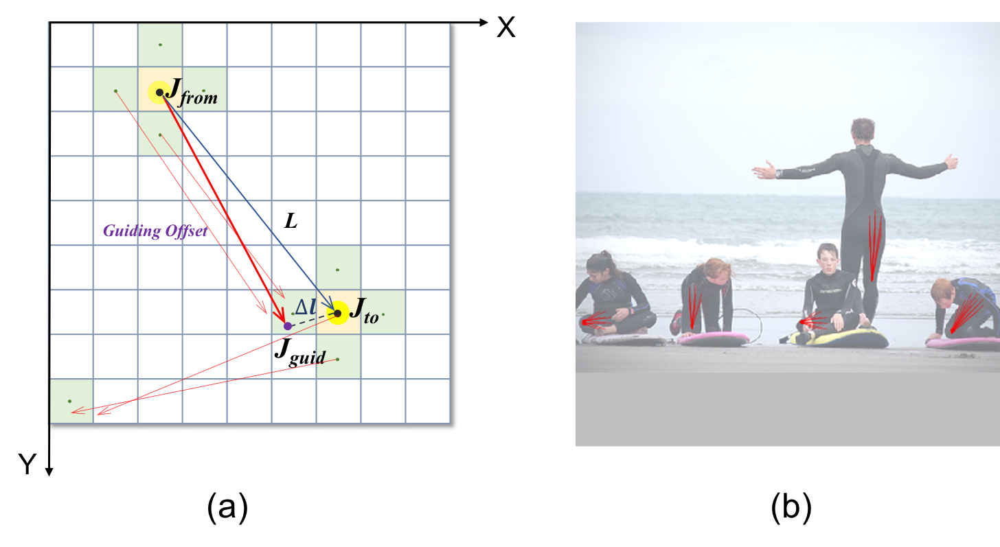
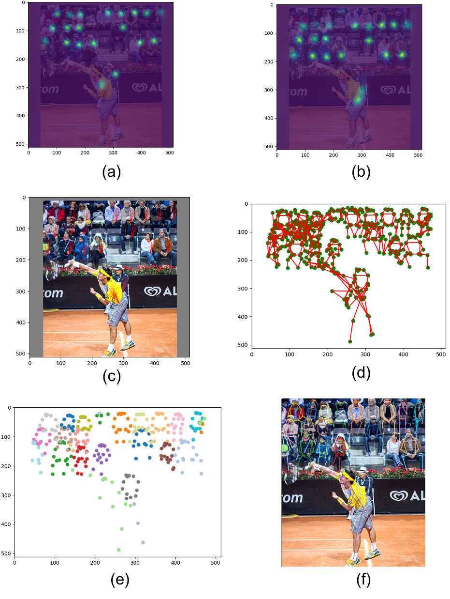

# SimplePose V2

Building a simple baseline for bottom-up human pose estimation. Welcome to contribute to this project.

Earlier project: [SimplePose](https://github.com/hellojialee/Improved-Body-Parts)


## Introduction

### A bottom-up approach for the problem of multi-person pose estimation

Guiding offsets greedily “connect” the adjacent keypoints belonging to the same persons.



### Overview of the proposed approach

(a): Responses of “left shoulder”    		     (b): Responses of “left hip”

(c): Guiding offsets from “left shoulder” to “left hip”   	  (d): Candidate keypoints and limbs

(e): Greedy keypoint grouping           		   (f): Final result



## Project Contents

1. Training Code
2. Evaluation Code
3. Image Demo
4. More (in development)

## Project Features

- Implement the models using Pytorch in auto mixed-precision (using Nvidia Apex).
- Support training on multiple GPUs (over 90% GPU usage rate on each GPU card).
- Fast data preparing and augmentation during training.
- Focal L2 loss for keypoint heatmap regression.
- L1-type loss for guiding offset regression.

## Prepare

1. Install packages according to `requirement.txt`.

   Python=3.6, Pytorch>1.0, Nvidia Apex and other packages needed.

2. Download the COCO dataset and CrowdPose dataset.

3. Download the pre-trained models via: [GoogleDrive](https://drive.google.com/drive/folders/1jG87NBm_wXKgKJh-VLkVkJTIV7vyiz1P?usp=sharing).

4. Change the paths in the code according to your environment.

5. Refer to the docs `cli-help-evaluate.txt`,`cli-help-train_dist.txt` to know the hypter-parameter settings and more info of this project.

6. Full project is to be released.


## Evaluation (single-scale input)

### Set the long side of the input image to 640

#### Run

```
python evaluate.py --no-pretrain --initialize-whole False --checkpoint-whole link2checkpoints_storage/PoseNet_77_epoch.pth --resume --sqrt-re --batch-size 8 --loader-workers 4 --thre-hmp 0.06 --topk 32 --headnets hmp omp --dist-max 40 --long-edge 640 --dataset val --flip-test --thre-hmp 0.04 --person-thre 0.04
```

> Hint: if you want to achieve a higher speed (30+ FPS on a 2080 TI), **do not** use `--flip-test`

#### Results on COCO validation dataset

```
 Average Precision  (AP) @[ IoU=0.50:0.95 | area=   all | maxDets= 20 ] = 0.661
 Average Precision  (AP) @[ IoU=0.50      | area=   all | maxDets= 20 ] = 0.854
 Average Precision  (AP) @[ IoU=0.75      | area=   all | maxDets= 20 ] = 0.714
 Average Precision  (AP) @[ IoU=0.50:0.95 | area=medium | maxDets= 20 ] = 0.622
 Average Precision  (AP) @[ IoU=0.50:0.95 | area= large | maxDets= 20 ] = 0.722
 Average Recall     (AR) @[ IoU=0.50:0.95 | area=   all | maxDets= 20 ] = 0.702
 Average Recall     (AR) @[ IoU=0.50      | area=   all | maxDets= 20 ] = 0.873
 Average Recall     (AR) @[ IoU=0.75      | area=   all | maxDets= 20 ] = 0.747
 Average Recall     (AR) @[ IoU=0.50:0.95 | area=medium | maxDets= 20 ] = 0.644
 Average Recall     (AR) @[ IoU=0.50:0.95 | area= large | maxDets= 20 ] = 0.787
```

#### Run

```
python evaluate.py --no-pretrain --initialize-whole False --checkpoint-whole link2checkpoints_storage/PoseNet_77_epoch.pth --resume --sqrt-re --batch-size 8 --loader-workers 4 --thre-hmp 0.06 --topk 32 --headnets hmp omp --dist-max 40 --long-edge 640 --dataset test-dev --flip-test --thre-hmp 0.04 --person-thre 0.04
```

> Hint: if you want to achieve a higher speed (30+ FPS on a 2080 TI), **do not** use `--flip-test`

#### Results on COCO test-dev dataset

```
 Average Precision  (AP) @[ IoU=0.50:0.95 | area=   all | maxDets= 20 ] = 0.647
 Average Precision  (AP) @[ IoU=0.50      | area=   all | maxDets= 20 ] = 0.858
 Average Precision  (AP) @[ IoU=0.75      | area=   all | maxDets= 20 ] = 0.705
 Average Precision  (AP) @[ IoU=0.50:0.95 | area=medium | maxDets= 20 ] = 0.607
 Average Precision  (AP) @[ IoU=0.50:0.95 | area= large | maxDets= 20 ] = 0.704
 Average Recall     (AR) @[ IoU=0.50:0.95 | area=   all | maxDets= 20 ] = 0.696
 Average Recall     (AR) @[ IoU=0.50      | area=   all | maxDets= 20 ] = 0.886
 Average Recall     (AR) @[ IoU=0.75      | area=   all | maxDets= 20 ] = 0.748
 Average Recall     (AR) @[ IoU=0.50:0.95 | area=medium | maxDets= 20 ] = 0.636
 Average Recall     (AR) @[ IoU=0.50:0.95 | area= large | maxDets= 20 ] = 0.779
```

### Fix the height of the input image to 640

#### COCO test-dev dataset

```
python evaluate.py --no-pretrain --initialize-whole False --checkpoint-whole link2checkpoints_storage/PoseNet_77_epoch.pth --resume --sqrt-re --batch-size 8 --loader-workers 4 --thre-hmp 0.06 --topk 32 --headnets hmp omp --dist-max 40 --long-edge 640 --dataset test-dev --flip-test --fixed-height --thre-hmp 0.04 --person-thre 0.04
```

```
Average Precision  (AP) @[ IoU=0.50:0.95 | area=   all | maxDets= 20 ] = 0.656
 Average Precision  (AP) @[ IoU=0.50      | area=   all | maxDets= 20 ] = 0.859
 Average Precision  (AP) @[ IoU=0.75      | area=   all | maxDets= 20 ] = 0.713
 Average Precision  (AP) @[ IoU=0.50:0.95 | area=medium | maxDets= 20 ] = 0.633
 Average Precision  (AP) @[ IoU=0.50:0.95 | area= large | maxDets= 20 ] = 0.688
 Average Recall     (AR) @[ IoU=0.50:0.95 | area=   all | maxDets= 20 ] = 0.702
 Average Recall     (AR) @[ IoU=0.50      | area=   all | maxDets= 20 ] = 0.886
 Average Recall     (AR) @[ IoU=0.75      | area=   all | maxDets= 20 ] = 0.750
 Average Recall     (AR) @[ IoU=0.50:0.95 | area=medium | maxDets= 20 ] = 0.659
 Average Recall     (AR) @[ IoU=0.50:0.95 | area= large | maxDets= 20 ] = 0.762
```

### CrowdPose testset
Change the cofig file to crowdpose
```
python evaluate_crowd.py --no-pretrain --initialize-whole False --checkpoint-whole link2checkpoints_storage_crowdpose/PoseNet_190_epoch.pth --resume --sqrt-re --batch-size 4 --loader-workers 4 --thre-hmp 0.04 --topk 32 --headnets hmp omp --dist-max 40 --long-edge 640 --dataset test  --person-thre 0.02 --flip-test --fixed-height
```

```
Average Precision (AP) @[ IoU=0.50:0.95 | area= all | maxDets= 20 ] = 0.652
Average Precision (AP) @[ IoU=0.50 | area= all | maxDets= 20 ] = 0.859
Average Precision (AP) @[ IoU=0.75 | area= all | maxDets= 20 ] = 0.695
Average Recall (AR) @[ IoU=0.50:0.95 | area= all | maxDets= 20 ] = 0.706
Average Recall (AR) @[ IoU=0.50 | area= all | maxDets= 20 ] = 0.892
Average Recall (AR) @[ IoU=0.75 | area= all | maxDets= 20 ] = 0.743
Average Precision (AP) @[ IoU=0.50:0.95 | type= easy | maxDets= 20 ] = 0.738
Average Precision (AP) @[ IoU=0.50:0.95 | type=medium | maxDets= 20 ] = 0.662
Average Precision (AP) @[ IoU=0.50:0.95 | type= hard | maxDets= 20 ] = 0.548
```


## Training

In our paper, we fine-tune the pre-trained model `multi_pose_hg_3x.pth` in [CenterNet](https://github.com/xingyizhou/CenterNet). For simplicity, you can employ our pre-trained models (i.e., training from a checkpoint in [GoogleDrive](https://drive.google.com/drive/folders/1jG87NBm_wXKgKJh-VLkVkJTIV7vyiz1P?usp=sharing)).

**Run example:**

```
python -m torch.distributed.launch --nproc_per_node=4 train_dist.py --basenet-checkpoint weights/hourglass_104_renamed.pth --checkpoint-whole link2checkpoints_storage/PoseNet_77_epoch.pth --resume --weight-decay 0 --hmp-loss focal_l2_loss --offset-loss offset_instance_l1_loss --sqrt-re --include-scale --scale-loss scale_l1_loss  --lambdas 1 0 0 10000 10 --headnets hmp omp --learning-rate 1.25e-4 --fgamma 2 --drop-amp-state --drop-optim-state
```


## Acknowledgement

We refer to and borrow some code from [SimplePose](https://github.com/hellojialee/Improved-Body-Parts), [OpenPifPaf](https://github.com/openpifpaf/openpifpaf), [CenterNet](https://github.com/xingyizhou/CenterNet), etc.


## Citation

If this work help your research, please cite the corresponding paper:

```
@inproceedings{li2020simple,
  title={Simple pose: Rethinking and improving a bottom-up approach for multi-person pose estimation},
  author={Li, Jia and Su, Wen and Wang, Zengfu},
  booktitle={Proceedings of the AAAI conference on artificial intelligence},
  volume={34},
  number={07},
  pages={11354--11361},
  year={2020}
}
```

